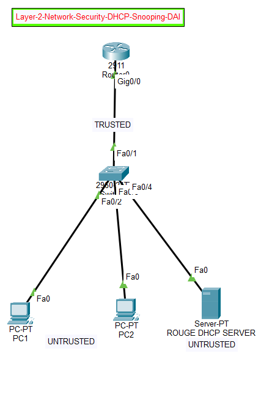

Layer 2 Network Security using DHCP Snooping & DAI
📌 Overview

A Cisco Packet Tracer project demonstrating Layer 2 security against:

Rogue DHCP Servers
ARP Spoofing / ARP Poisoning
Invalid ARP Traffic
Technologies Used
DHCP Snooping
Dynamic ARP Inspection (DAI)
DHCP Binding Database
ARP Validation
🏗️ Topology
       
🔐 Security Configuration
Port	Device	Status
Fa0/1	R1	Trusted
Fa0/2	PC1	Untrusted
Fa0/3	PC2	Untrusted
Fa0/4	Rogue DHCP	Untrusted
DHCP Snooping
ip dhcp snooping
ip dhcp snooping vlan 1

interface fa0/1
 ip dhcp snooping trust
Dynamic ARP Inspection
ip arp inspection vlan 1

interface fa0/1
 ip arp inspection trust

ip arp inspection validate src-mac dst-mac ip
🧪 Verification
show ip dhcp snooping
show ip dhcp snooping binding
show ip arp inspection
show ip arp inspection interfaces
show ip arp inspection statistics
🚨 Attack Testing
Rogue DHCP

A Server-PT was configured as a rogue DHCP server on Fa0/4. Since Fa0/4 is untrusted, DHCP Snooping prevents the port from being treated as a trusted DHCP-server interface.

ARP Spoofing

DAI validates ARP traffic using the DHCP Snooping binding database and helps prevent invalid ARP information on untrusted ports.

Packet Tracer does not provide a full arpspoof/Ettercap-style attack tool, so ARP protection is verified through DAI configuration and statistics.
